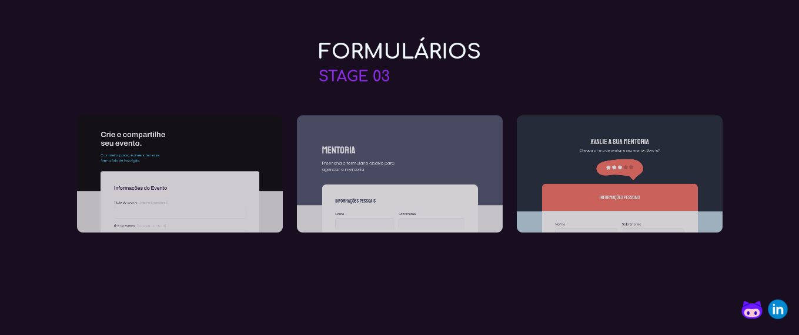

# STAGE 03

LAYOUT

Acesse: [Projetos do Stage 03](https://www.lfoalves.github.io/explorer/step3/stage3/index.html)

Links para acessar os projetos:

[CODE - Formulários](https://www.github.com/lfoalves/explorer/step3/stage3/formulários)

[PAGE - Form 01](https://www.lfoalves.github.io/explorer/step3/stage3/formularios/form1.index.html)

[PAGE - Form 02](https://www.lfoalves.github.io/explorer/step3/stage3/formularios/form2.index.html)

[PAGE - Form 03](https://www.lfoalves.github.io/explorer/step3/stage3/formularios/form3.index.html)

#

[CODE - Introdução à Responsividade](https://www.github.com/lfoalves/explorer/step3/stage3/introducao_responsividade)

[PAGE - Introdução à Responsividade](https://www.lfoalves.github.io/explorer/step3/stage3/introducao_responsividade/index.index.html)

#

[CODE - Gird com Animações](https://www.github.com/lfoalves/explorer/step3/stage3/grid_com_animacoes)

[PAGE - Gird com Animações](https://www.lfoalves.github.io/explorer/step3/stage3/grid_com_animacoes/index.html)

#

[CODE - Space Cream](https://www.github.com/lfoalves/explorer/step3/stage3/space_cream)

[PAGE - Space Cream](https://www.lfoalves.github.io/explorer/step3/stage3/space_cream/index.html)

 

Autor: [Luiz Fernando](https://www.linkedin.com/in/lfoalves)